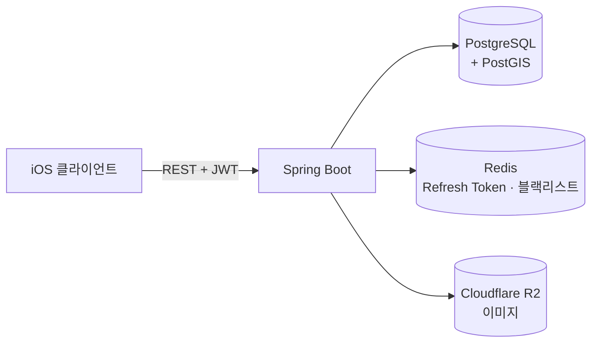
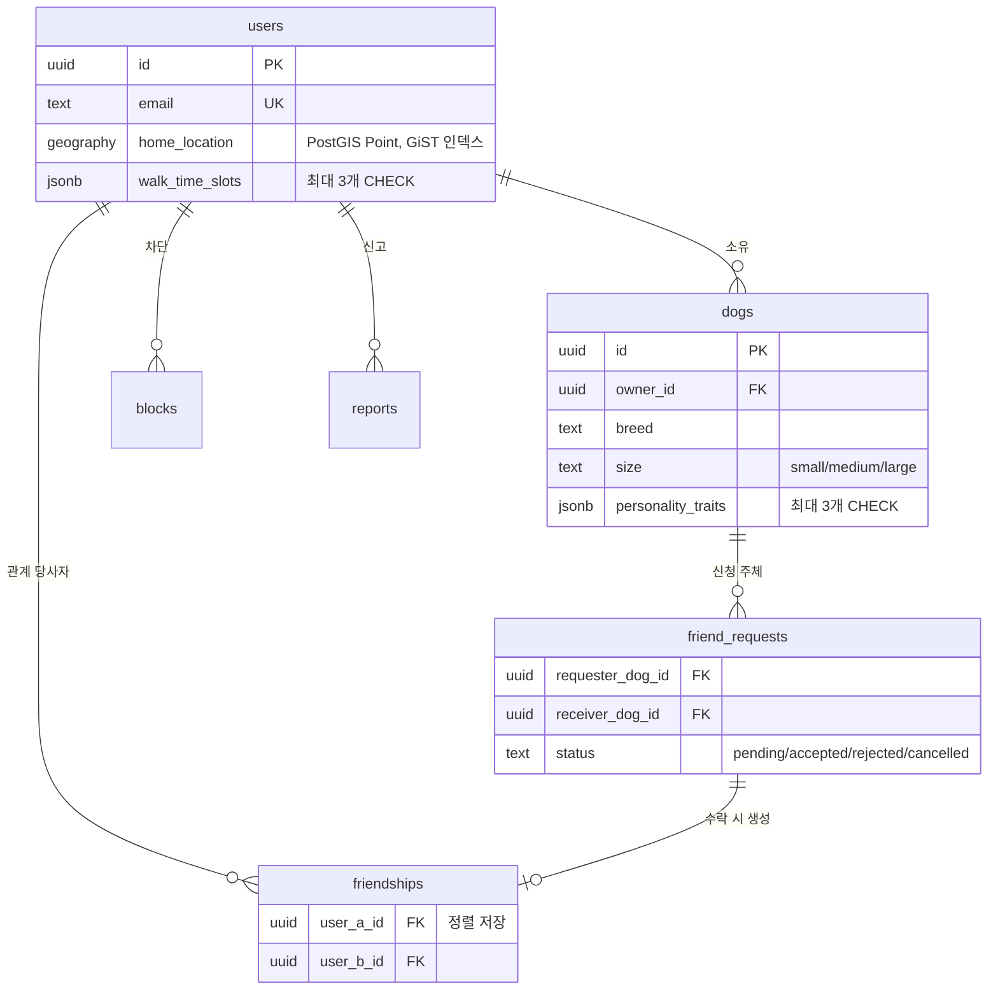

# 꼬동 (KKODONG) — 서버

> **"우리 강아지의 친구를 만드는 곳"**
> 견주가 아니라 **강아지 사이의 친구 관계**를 맺어주는 산책 소셜 서비스의 백엔드입니다.

반려견 산책 앱은 이미 많지만 대부분 **견주 커뮤니티**입니다. 꼬동은 성향·체급·산책
시간대가 맞는 **주변 강아지를 추천**하고, 친구가 된 뒤 산책 약속으로 이어지는 흐름에
집중합니다.

개인 프로젝트로 기획·설계·구현을 전부 맡고 있으며, **현재 개발 중**입니다.
아래 "진행 현황"에 어디까지 됐는지 정리해 뒀습니다.

기획부터 스키마·알고리즘 설계까지 **[`docs/`](docs/)에 전부 문서로 남겨 뒀습니다** —
[기획서](docs/product/CONCEPT.md) · [시장조사](docs/product/MARKET.md) ·
[결정 기록](docs/product/DECISIONS.md) · [API 명세](docs/design/API_SPEC.md) ·
[DB 스키마](docs/design/DB_SCHEMA.sql) ·
[추천 알고리즘](docs/design/RECOMMENDATION.md) · [진행 현황](docs/TICKETS.md)

---

## 기술 스택

| 분류 | 기술 | 선택 이유 |
|---|---|---|
| 언어·프레임워크 | Java 17, Spring Boot 3.5 | |
| 인증 | Spring Security + JWT (Access/Refresh) | 서버가 상태를 갖지 않아 확장에 유리. Refresh Token은 Redis에 저장해 로그아웃·탈퇴 시 즉시 폐기 가능하게 |
| DB | PostgreSQL + **PostGIS** | 추천의 1순위 신호가 거리다. `ST_DWithin`이 GiST 인덱스를 타므로 애플리케이션에서 거리를 계산하는 방식보다 후보 조회가 압도적으로 빠르다 |
| 마이그레이션 | Flyway | 스키마를 코드로 관리. `ddl-auto: validate`로 엔티티-테이블 불일치를 기동 시 검출 |
| 캐시 | Redis | Refresh Token 저장 + 로그아웃 토큰 블랙리스트 |
| 스토리지 | Cloudflare R2 | S3 호환 API를 쓰면서 **egress 요금이 없다**. 강아지 사진·누끼 이미지가 피드·산책 카드에서 반복 노출되는 구조라 전송량이 비용을 좌우한다 |
| 문서화 | SpringDoc OpenAPI (Swagger UI) | |

## 아키텍처



레이어는 도메인별 패키지로 나눕니다 — `domain/<이름>/`에 각각
`controller · service · repository · domain · dto`를 두고, 공통 인프라는 `global/`
(`security · config · error · storage · external · util`)에 둡니다.

견주 앱용 도메인은 `dog · friend · safety · user`,
점주 앱(꼬동 파트너)용은 `merchant · enrollment · reservation · note · media ·
assignment · review`입니다. 두 앱은 별도 앱이지만 **계정(`users`)과 서버는 공유**하며,
점주 API는 전부 `/api/v1/partner/**` 아래에 있습니다 — 경로를 갈라 두면
"점주 API는 매장 소속·권한을 반드시 검증한다"는 규칙을 경로 단위로 걸 수 있습니다.

## 데이터 모델



전체 스키마와 각 결정의 근거는 [`DB_SCHEMA.sql`](docs/design/DB_SCHEMA.sql)에
주석으로 남겨 뒀습니다.

---

## 기술적 의사결정

이 프로젝트에서 가장 오래 고민한 것들입니다.

### 1. 추천 후보 풀을 요청 `limit`과 분리했다

후보를 `ORDER BY 거리 LIMIT :limit`으로 뽑으면, 나머지 5개 신호는 **이미 거리로
걸러진 20마리의 순서만 바꿉니다.** 거리가 사실상 하드 필터가 되는 것입니다.

반경 안에서는 거리의 변별력이 오히려 가장 낮습니다. 1km 반경에서 거리 점수 폭은
최대 6점(30 → 24)인데, 성격(0~20)과 시간대(0~15)는 합쳐서 35점이 움직입니다.

> 1km 안에 300마리가 있으면 20번째로 가까운 개는 258m에 있습니다. 260m에 있는
> "시간대·성격이 완벽히 맞는 개"는 120m에 있는 "아무것도 안 맞는 개"에게
> **거리 0.9점 차로 밀려** 화면에 뜨지 못합니다. 점수로는 34점을 이기는데도요.

그래서 점수를 매길 후보 풀 상한(`candidate-cap: 300`)을 응답 개수와 **독립된
설정값**으로 두고, `PropertiesBindingTest`가 `candidateCap > limit 상한`을 검증합니다.
콜드스타트 구간에서는 후보가 20마리도 안 되어 증상이 안 보이고, **서비스가 성장하는
바로 그 시점에 문제가 시작되는** 종류의 버그입니다.

### 2. 매칭 조건을 WHERE가 아니라 ORDER BY로 쓴다

성향·견종·나이·시간대를 필터로 쓰면 초기 사용자에게 **빈 화면**이 나옵니다. 후보가
3마리인 동네에서 조건을 걸면 0마리가 되기 때문입니다. 그래서 **반경만 조건**이고
나머지는 전부 가중치입니다 — 안 맞아도 사라지지 않고 순위만 내려갑니다.

같은 이유로 **미입력 값을 0점이 아니라 중립(0.5)으로** 처리합니다. 온보딩에서 성향
태그를 건너뛴 신규 사용자가 0점을 받으면 추천 하위에 영구히 깔려 아무에게도 노출되지
않고, 그러면 서비스가 스스로 콜드스타트를 만들어냅니다.

가중치·반경·중립값은 전부 `application.yml` 설정값입니다. 이 숫자들의 유일한 검증
수단이 실사용 데이터인데, 조정할 때마다 재배포해야 하면 실제로는 튜닝을 안 하게 됩니다.

### 3. 친구 관계의 단위를 강아지가 아니라 견주로 잡았다

신청은 강아지 단위지만(추천이 강아지 대 강아지이므로), 맺어진 관계는 **견주 쌍에
유일**합니다. 강아지 쌍을 유일 단위로 두면 다견 가정에서 곧바로 깨집니다.

```
나: 몽이·초코,  상대: 두부
몽이→두부 수락 → friendship#1 → 채팅방 1
초코→두부 수락 → friendship#2 → 채팅방 2   ← 같은 두 사람에게 방이 2개
```

채팅과 산책 약속이 전부 `friendship_id`에 매달리는데, 사람 둘이 만나는 약속이 어느
행에 붙어야 하는지 정할 근거가 없어집니다. **유일성의 단위는 나중에 바꾸기가 매우
비쌉니다** — 이미 생긴 중복 행과 채팅방을 사후 병합해야 하니까요. 반대로 세분화가
나중에 필요해지면 `friendship_dogs` 테이블을 추가하고 백필하면 됩니다. 어려운 쪽을
지금 맞추고 쉬운 쪽을 미루는 선택입니다.

### 4. 페이지네이션에 offset이 아니라 커서를 쓴다

추천 반경은 후보 수에 따라 `1→2→3→5km`로 자동 확장됩니다. 그런데 페이지마다 확장을
다시 계산하면 **페이지 사이에 후보 집합 자체가 바뀌어** 중복·누락이 생깁니다.
그래서 첫 페이지에서 확정한 반경을 오프셋과 함께 커서에 인코딩해 돌려줍니다.

### 5. 값 유효성은 설정값, 개수 제한은 DB 제약

성향 태그와 산책 시간대는 JSONB 배열입니다. **어떤 값이 유효한가**는 실사용 데이터에
따라 바뀔 수 있어 `application.yml`이 담당하고(바꿔도 마이그레이션 불필요), **최대
3개**라는 개수는 추천 공식의 전제라 DB CHECK 제약으로 겁니다.

시간대 점수는 중첩계수 `|교집합| / min(|A|,|B|)`로 계산하는데, 상한이 없으면 6개를
전부 고른 사용자가 **모두와 1.0으로 겹쳐 추천 상위를 독식**합니다. 애플리케이션이
우회당해도 데이터가 오염되지 않도록 마지막 방어선을 DB에 뒀습니다.

## 트러블슈팅

**추천 조회가 `No argument for named parameter ':excludedUserIds'`로 실패**

IDE 자동완성이 `org.springframework.data.repository.query.Param` 대신
`io.lettuce.core.dynamic.annotation.Param`(Redis 클라이언트의 동명 어노테이션)을
import했습니다. Spring Data는 이 어노테이션을 모르므로 무시하고 **컴파일된 자바
파라미터 이름으로 폴백**합니다.

그래서 이름이 우연히 일치하던 `:me`·`:lat`·`:radiusMeters`는 정상 바인딩되고,
`excludeUserIds`(자바) ↔ `:excludedUserIds`(쿼리) 하나만 실패했습니다. **한 파라미터만
터진다는 점**이 오히려 원인을 좁히는 단서였습니다 — 어노테이션이 전부 무시되고 있다는
뜻이었으니까요. import를 교체하고 파라미터 이름을 통일해 해결했습니다.

---

## API

Swagger UI: `/swagger-ui/index.html` (JWT Authorize로 인증 API도 바로 테스트 가능)

| 메서드 | 경로 | 설명 |
|---|---|---|
| POST | `/api/v1/auth/signup`, `/login`, `/logout`, `/refresh` | 이메일 인증 |
| POST | `/api/v1/auth/apple` | Sign in with Apple |
| GET·PATCH·DELETE | `/api/v1/users/me` | 프로필 조회·수정·탈퇴 |
| PATCH | `/api/v1/users/me/onboarding` | 온보딩 완료 처리 |
| POST·GET·PATCH·DELETE | `/api/v1/dogs`, `/dogs/{id}` | 반려견 CRUD |
| POST | `/api/v1/dogs/{id}/photo`, `/cutout` | 사진·누끼 업로드 (R2) |
| GET | `/api/v1/friends/recommendations` | 주변 강아지 추천 |
| POST·DELETE·GET | `/api/v1/blocks` | 차단·해제·목록 |
| POST | `/api/v1/reports` | 신고 접수 |

**응답 규약** — 모든 응답을 `ApiResponse` envelope로 감싸므로 **성공에 204를 쓰지
않습니다**(삭제·로그아웃도 `200 + data: null`). JSON 필드는 camelCase, DB
컬럼·테이블명은 snake_case입니다.

## 실행 방법

```bash
# 1. 로컬 인프라 (PostGIS + Redis)
docker compose up -d

# 2. (환경변수 불필요) — application-local.yml이 로컬 DB·Redis·포트를 모두 담고 있습니다.
#    원격 DB로 붙일 때만 .env를 쓰고, 그때는 local 프로파일을 쓰지 않습니다.

# 3. 실행 — 기동 시 Flyway가 V1~V9를 순서대로 적용
./gradlew bootRun --args='--spring.profiles.active=local'
```

Supabase 등 관리형 Postgres를 쓸 경우 대시보드에서 **postgis 확장을 먼저 활성화**해
두는 편이 안전합니다.

**추천 API 확인용 더미 데이터** — 후보가 될 다른 사용자가 있어야 결과가 나옵니다.

```bash
docker exec -i kkodong-postgres psql -U postgres -d kkodong < seed/dev_seed.sql
```

반경 밖·위치 미설정·태그 미입력 케이스가 포함돼 있어 반경 필터와 중립값 처리를 함께
검증할 수 있습니다. 재실행해도 안전하고, 로컬 DB는 서버를 재시작해도 초기화되지
않습니다(`docker compose down -v`를 하면 볼륨과 함께 사라집니다).

## 진행 현황

| 도메인 | 상태 |
|---|---|
| 인증 (이메일 + Apple), 프로필, 온보딩 | ✅ |
| 반려견 CRUD + 이미지 업로드 | ✅ |
| 차단 · 신고 | ✅ |
| **친구 추천** | 🟡 후보 조회까지. 점수 계산·이유 문장·커서 미착수 |
| 친구 신청/수락, 채팅, 산책 기록, 커뮤니티 | ⬜ |
| **꼬동 파트너(점주 앱) 서버** | 🟢 PN 20개 중 18개. API 72개 |

> ⚠️ 점주 앱은 로드맵상 Phase 3이며 별도 지시로 선행 구현했습니다. 핵심 루프
> (친구 → 채팅 → 산책 → 카드)는 여전히 미완이고 그쪽이 이 제품의 존재 이유입니다.
> 남은 PN-16·PN-17은 APNs 인프라가 없어 대기 중입니다.

티켓 단위의 상세 현황과 착수 순서는
[`TICKETS.md`](docs/TICKETS.md)에 있습니다.
